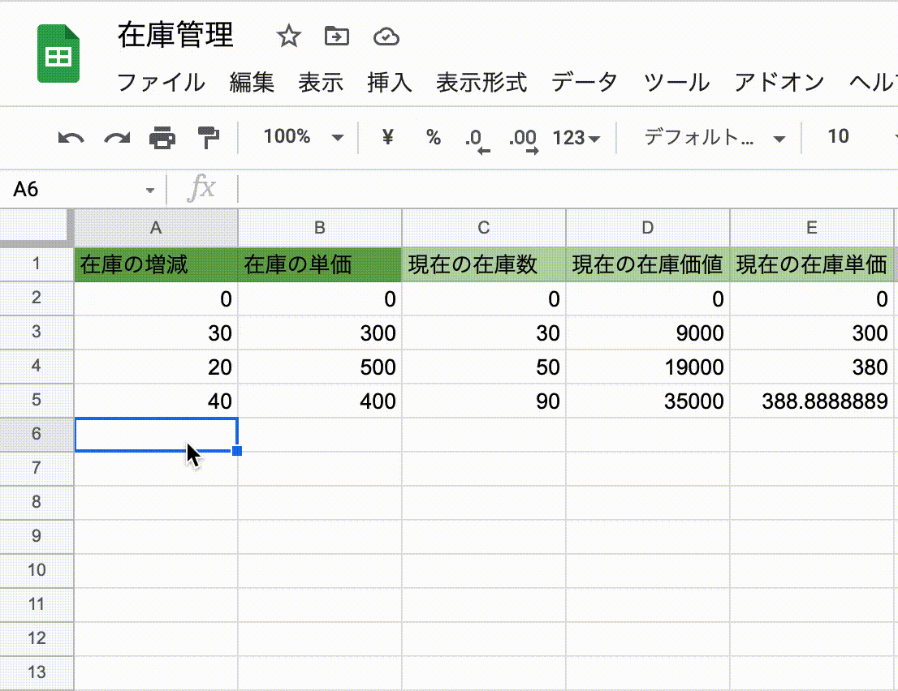

# GASで在庫管理をサクッと実装した話


---

## 目次

1. ある日のこと
2. Google App Script（GAS）とはなにか
3. 先入先出法について
4. 作ったプログラム
5. claspでローカルでGASを書く
6. まとめ

---

## ある日のこと

上長「在庫管理したいんだけど、スプレッドシートでこれ出来る？」
上長「先入先出法っていうのがあって...」
ぼく「なるほど...」

~~ 30分後 ~~

ぼく「スプレッドシートだと難しいと思います！」
ぼく「プログラムを書きたくなるやつですね」

---

## ある日のこと（続き）

~~ その日の夜 ~~

ぼく「あ！そういえばGASがあったわ！作っちゃお！！」

~~ 翌日の朝 ~~

ぼく「なんかできた！！」

---

## できたもの



---

## 先入先出法とは

先に仕入れた商品から先に販売したと仮定して、棚卸資産（在庫の価値）を計算する方法。

例)
りんごを300円×30個、500円×20個、400円×40個の順に仕入れる

棚卸資産は、

20個販売したとき 300×10+500×20+400×40 = 29000円
40個販売したとき 500×10+400×40 = 21000円

---

## Google App Script（GAS）とは

- Googleのサービスと連携したアプリケーションを作るためのプラットフォーム
  - Gmail、Google Drive、Google Calender、etc...

- JavaScriptで書ける！
  - 処理系がChromeと同じV8エンジン

---

## 作ったプログラム（入力）

在庫の個数と価値のペアをシートから読み込む

```javascript
const makeStocks = (lastRowIndex) => {
  const stocks = [];
  for(let i = OFFSET_ROW; i <= lastRowIndex; i++){
    const count = sheet.getRange(i, OFFSET_COL).getValue();
    if (count > 0) {
      const price = sheet.getRange(i, OFFSET_COL + 1).getValue();
      stocks.push({ count, price });
    }
  }
  return stocks;
};
```

---

## 作ったプログラム（計算）

在庫と引き出した個数の累計から、引き出した在庫の価値を求める

```bash
> const stocks = [
...   { price: 300, count: 3 },
...   { price: 500, count: 2 },
...   { price: 400, count: 3 },
... ];
> const consumedCounts = [0, 0, 0, 2, 4, 5, 8];
> let calcConsumedPriceSum;
> import("./src/lib/calcConsumedPriceSum.js").then((module) => calcConsumedPriceSum = module.default);
> calcConsumedPriceSum(stocks, consumedCounts);
[
     0,    0,    0,
   600, 1400, 1900,
  3100
]
```

---

## 作ったプログラム（出力）

計算した値をセルに出力する

```javascript
const setPriceSum = (priceSumList) => {
  priceSumList.forEach((priceSum, index) => {
    sheet.getRange(OFFSET_ROW + 1 + index, CONSUMED_COUNT_COL + 1).setValue(priceSum);
  });
}
```

---

## 作ったプログラム（トリガーの設定）

セルを変更したときに計算を実行する

```javascript
const onEdit = () => {
  const lastRowIndex = calcLastRowIndex();
  const stocks = makeStocks(lastRowIndex);
  const priceSumList = calcResult(stocks, lastRowIndex);
  setPriceSum(priceSumList);
  clearPriceSum(priceSumList.length);
};
```

---

## claspでローカルでGASを書く

- claspを使うと、スクリプトをローカルで書いてpush/pullできる
- clasp pushが少し時間がかかる

今回のリポジトリ
[https://github.com/tekihei2317/gas-inventory-management](https://github.com/tekihei2317/gas-inventory-management)

---

## まとめ

- GASはJSで書けるので便利！

---

## 参考サイト

- [GAS（Google Apps Script）入門｜エクセルの神髄](https://excel-ubara.com/apps_script1/)
- [GAS のGoogle謹製CLIツール clasp - Qiita](https://qiita.com/HeRo/items/4e65dcc82783b2766c03)
