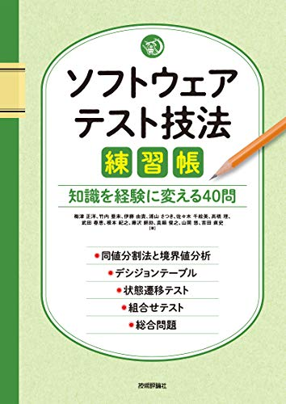

# ソフトウェアテスト技法練習帳を読んだ感想

---

## 目次

1. ソフトウェアテスト技法練習帳とは
2. 代表値テスト・境界値テスト
3. デシジョンテーブル
4. 状態遷移テスト
5. 組み合わせテスト
6. まとめ

---

## ソフトウェアテスト技法練習帳とは

- 「ソフトウェアテスト技法」を実践できる問題集
- ソフトウェアテスト技法って何...？

---

## 代表値テスト・境界値テスト

入力値の候補が多い場合に選択肢になるテスト。

例) 遊園地の入場料

小学生以下（12歳以下）、高校生以下（18歳以下）、大人（19歳以上）で料金が分かれていたとする。

入力値の候補は、例えば0~120歳までなどたくさんあって、全てを試すのは効率的ではない。

---

## 代表値テスト・境界値テストの気持ち

代表値テスト:  10歳、15歳、30歳
境界値テスト: 0歳、12歳、13歳、18歳、19歳、120歳を試す

代表値テスト → ロジックがおおまかにあっていることを確かめる
境界値テスト → ロジックがほぼあっていることを確かめる

代表値テストは、例えばどの年齢でも同じ値段になっているなどの致命的なミスがないことを確かめられる。
境界値テストは、条件の境界が正しいことを確かめられる

---

## デシジョンテーブル

入力値の候補を全て試すテスト。代表値テストのように、結果が同じことを期待されるグループに分けてテストすることもある。

---

## 状態遷移テスト

その名前の通り状態遷移のテスト。状態遷移はプログラムに書かれているので、わざわざテストする必要はないのではと思ったりしている。

---

## 組み合わせテスト

TODO:

---
